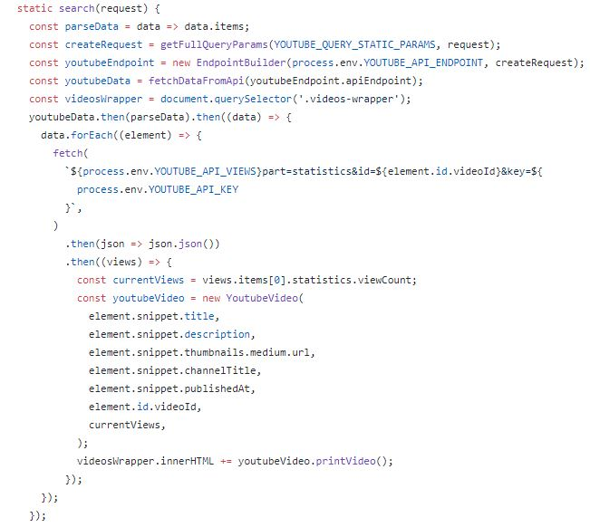

Siarhei Lisiunin
Contacts: E-mail: solimr111@mail.ru. Mobile phone, Telegram, Viber: +375291191994
The main goal is to realize wish of full time work as javascript developer.
Also important things for me is getting experience and meeting new people.
Skills: HTML, CSS, Git, JS, Bem, SASS.
Code examples: 

Experience: HTML,CSS, Javascript tests, creating a few adaptive landings, work with REST API, tasks which use Javascript core knowledges
Education: student of BSUIR
English level: A2. Trying to improve English language skill using Duolingo and listening English speach.
